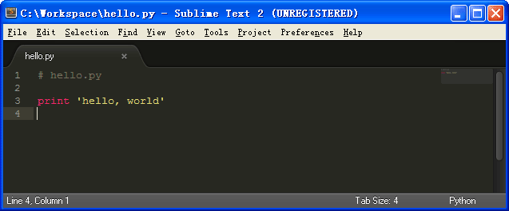
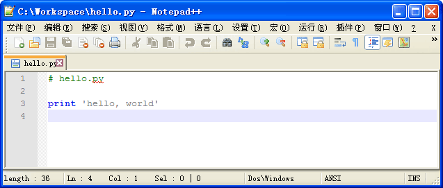
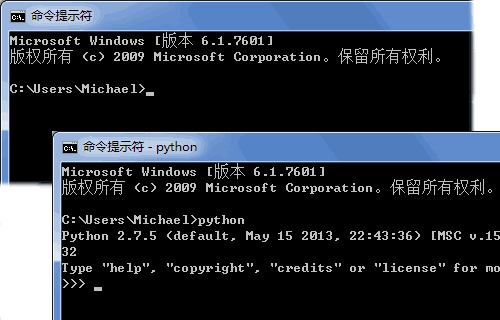

# 使用文本编辑器

阅读: 475976

在Python的交互式命令行写程序，好处是一下就能得到结果，坏处是没法保存，下次还想运行的时候，还得再敲一遍。

所以，实际开发的时候，我们总是使用一个文本编辑器来写代码，写完了，保存为一个文件，这样，程序就可以反复运行了。

现在，我们就把上次的'hello, world'程序用文本编辑器写出来，保存下来。

那么问题来了：文本编辑器到底哪家强？

推荐两款文本编辑器：

一个是Sublime Text，免费使用，但是不付费会弹出提示框：



一个是Notepad++，免费使用，有中文界面：



请注意，用哪个都行，但是绝对不能用Word和Windows自带的记事本。Word保存的不是纯文本文件，而记事本会自作聪明地在文件开始的地方加上几个特殊字符（UTF-8 BOM），结果会导致程序运行出现莫名其妙的错误。

安装好文本编辑器后，输入以下代码：

```python
print 'hello, world'
```

注意print前面不要有任何空格。然后，选择一个目录，例如`C:\Workspace`，把文件保存为hello.py，就可以打开命令行窗口，把当前目录切换到hello.py所在目录，就可以运行这个程序了：

```command
C:\Workspace>python hello.py
hello, world
```
也可以保存为别的名字，比如abc.py，但是必须要以.py结尾，其他的都不行。此外，文件名只能是英文字母、数字和下划线的组合。

如果当前目录下没有hello.py这个文件，运行python hello.py就会报错：

```command
python hello.py
python: can't open file 'hello.py': [Errno 2] No such file or directory
```

报错的意思就是，无法打开hello.py这个文件，因为文件不存在。这个时候，就要检查一下当前目录下是否有这个文件了。

请注意区分命令行模式和Python交互模式：



看到类似`C:\>`是在Windows提供的命令行模式，看到`>>>`是在Python交互式环境下。

在命令行模式下，可以执行python进入Python交互式环境，也可以执行python hello.py运行一个.py文件，但是在Python交互式环境下，只能输入Python代码执行。

## 直接运行py文件

还有同学问，能不能像.exe文件那样直接运行.py文件呢？在Windows上是不行的，但是，在Mac和Linux上是可以的，方法是在.py文件的第一行加上：

```Linux
#!/usr/bin/env python
```

然后，通过命令：

```command
$ chmod a+x hello.py
```

就可以直接运行hello.py了，比如在Mac下运行：


## 小结

用文本编辑器写Python程序，然后保存为后缀为.py的文件，就可以用Python直接运行这个程序了。

Python的交互模式和直接运行.py文件有什么区别呢？

直接输入python进入交互模式，相当于启动了Python解释器，但是等待你一行一行地输入源代码，每输入一行就执行一行。

直接运行.py文件相当于启动了Python解释器，然后一次性把.py文件的源代码给执行了，你是没有机会输入源代码的。

用Python开发程序，完全可以一边在文本编辑器里写代码，一边开一个交互式命令窗口，在写代码的过程中，把部分代码粘到命令行去验证，事半功倍！前提是得有个27'的超大显示器！
