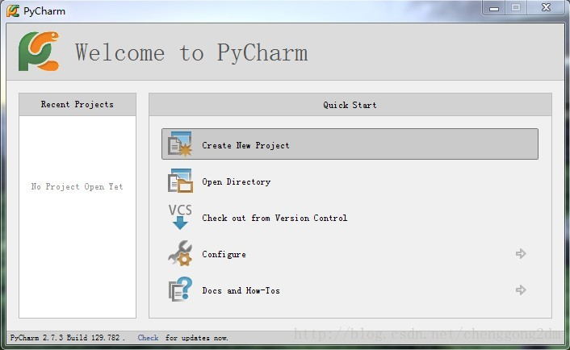
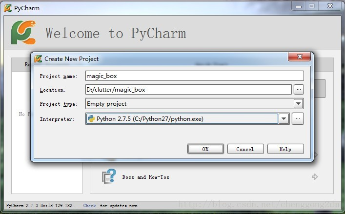
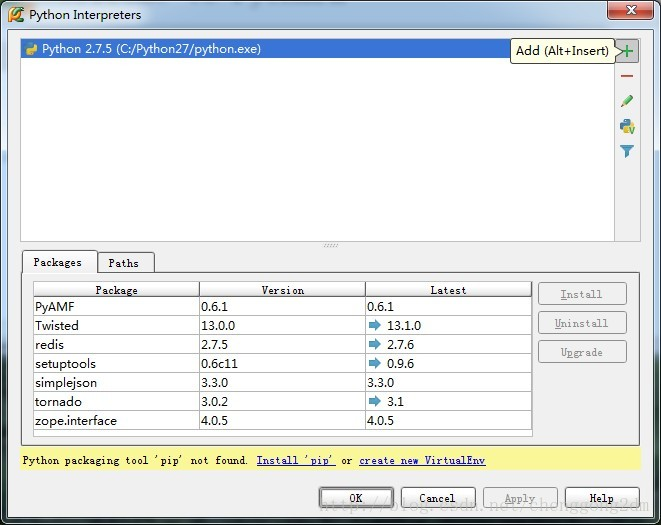

# Pycharm安装及配置

http://blog.csdn.net/rebelqsp/article/details/21548969

从知乎里看到了Pycharm的介绍，感觉还不错，记录下今天的安装过程

1. 从 http://www.jetbrains.com/pycharm/download/ 下载最新的Pycharm

2. 在终端中进入Pycharm的下载目录，输入命令 `tar xfz pycharm-*.tar.gz`，将Pycharm文件夹解压到当前目录

3. 找到bin文件夹运行./Pycharm.sh（.sh 是一个脚本文件，相当于win下的.exe）,输入注册码

```
user name: EMBRACE
key:
14203-12042010
0000107Iq75C621P7X1SFnpJDivKnX
6zcwYOYaGK3euO3ehd1MiTT"2!Jny8
bff9VcTSJk7sRDLqKRVz1XGKbMqw3G
```

5. 点击Create New Project.


6. 输入项目名、路径、选择Python解释器。如果没有出现python解释器，进入步骤3.（图片来自网络ubuntu下为/usr/bin/python3.2）


7. 选择python解释器。可以看到，一旦添加了python解释器，pycharm就会扫描出你已经安装的python扩展包，和这些扩展包的最新版本。（估计是pycharm连接了pypi）


8. 点击OK之后，就会创建一个空项目，里面包含一个.idea的文件夹，用于pycharm管理项目。

9. 新建一个文件
右键单击刚建好的helloWord项目，选择New --> Python File


10. Ctrl + Shift + F10运行

PS：其他的一些设置
1. Pycharm中默认是不能用Ctrl+滚轮改变字体大小的，需要的话可以在Editor-〉Mouse中设置
2. 要设置Pycharm的字体，要先在Editor中选择一种风格并保存，然后才可以改变
3. 在setting中搜索theme可以改变主题，所有配色统一改变
