参考文献：http://www.cnblogs.com/feixuelove1009/p/5823135.html

# Django快速参考

##  0.MTV模型

## 1.安装Django

sudo apt install python3-pip

pip3 install django

添加到系统环境变量中(win)

## 2.创建Django项目

file-->new project-->Django-->mysite

templates目录存放html文件，MTV中的T

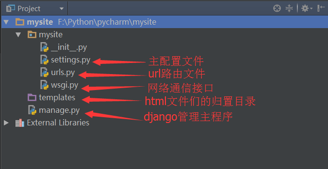

> 命令行：django-admin startproject mysite

## 3.创建APP

python manage.py startapp cmdb

创建了一个叫做cmdb的APP，django自动生成“cmdb”文件夹

> 命令行：django-admin startapp cmdb

## 4.编写路由

> urls.py, 将URL关联到views.py

## 5.编写业务处理逻辑

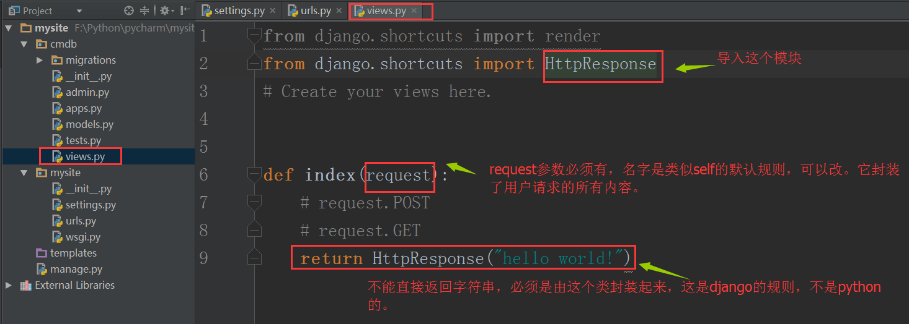
> views.py，让系统响应指定字符串

## 6.运行Web服务

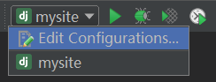

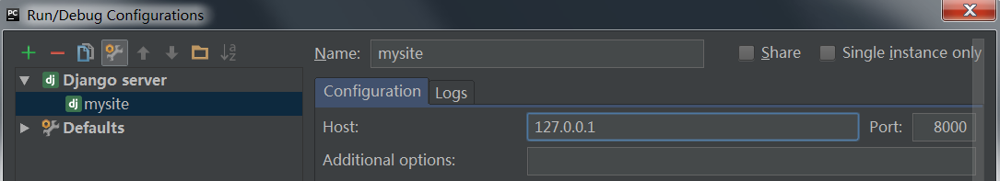
> 或 python manage.py runserver 127.0.0.1:8000

## 7.返回HTML文件

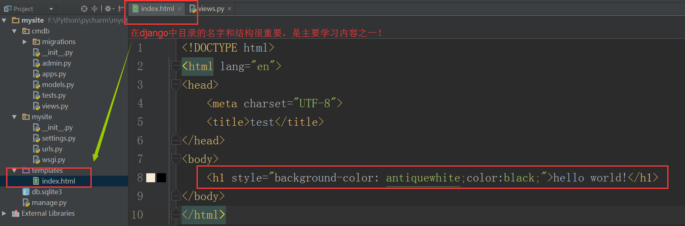
> index.html，用作网页显示

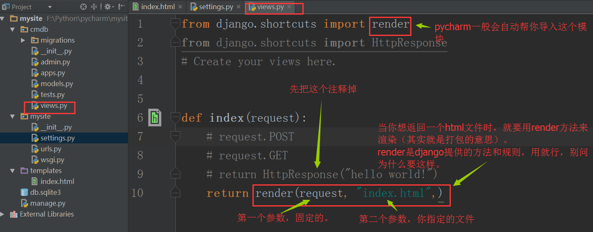
> views.py，让系统响应index.html文件

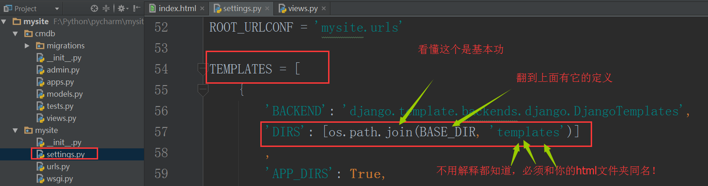
> 关联html目录, 默认不修改

## 8.使用静态文件

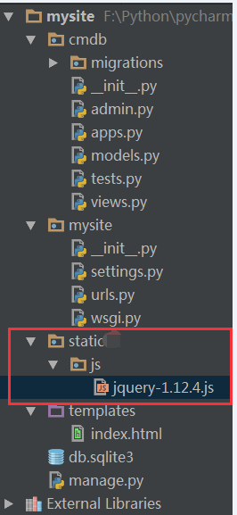
> 静态目录static, 用于存放CSS,JS,插件

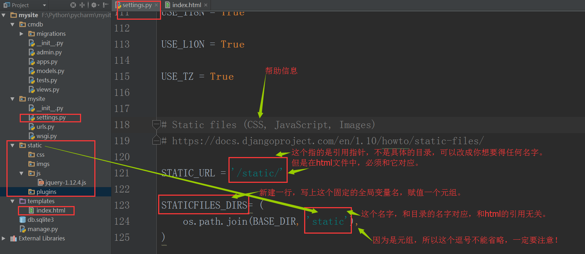
> settings.py, 关联静态目录

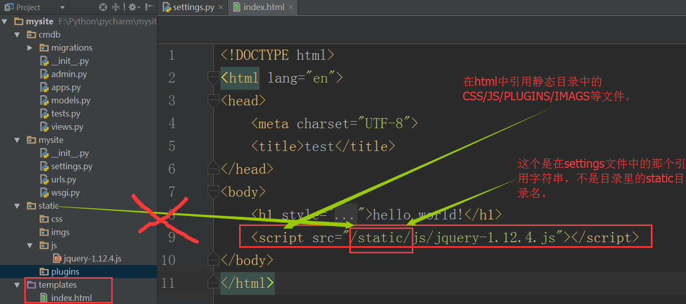
> index.html,引入js文件

## 9.接收用户发送的数据

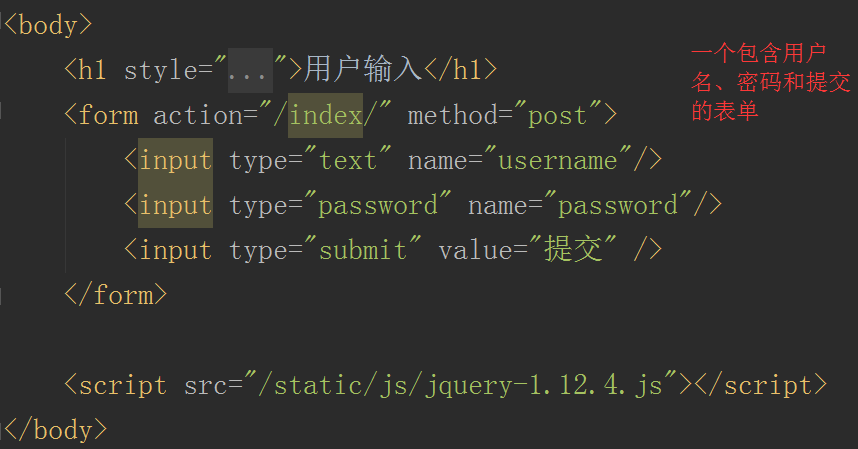
> index.html，加入表单

> views.py，接收网页数据

> settings.py，关闭保护机制

> 浏览器

## 10.返回动态页面

> views.py，数据中转站

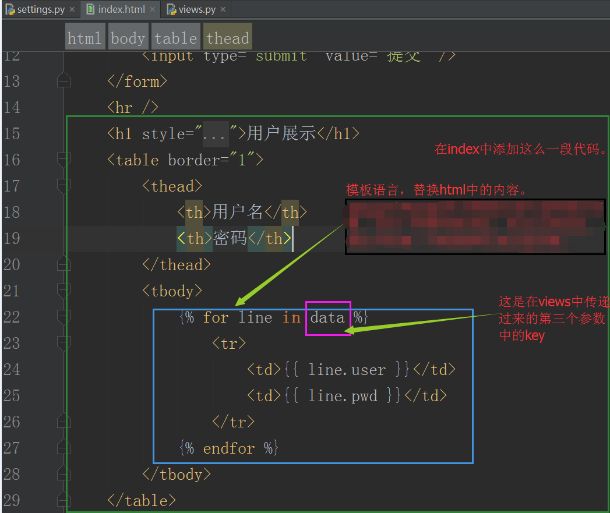
> index.html，动态显示数据

## 11.使用数据库

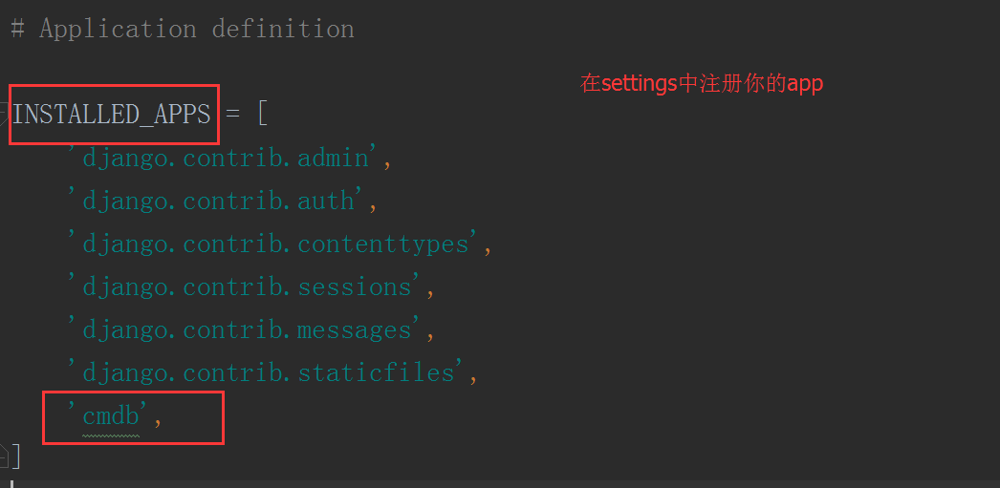
> settings.py, 注册app

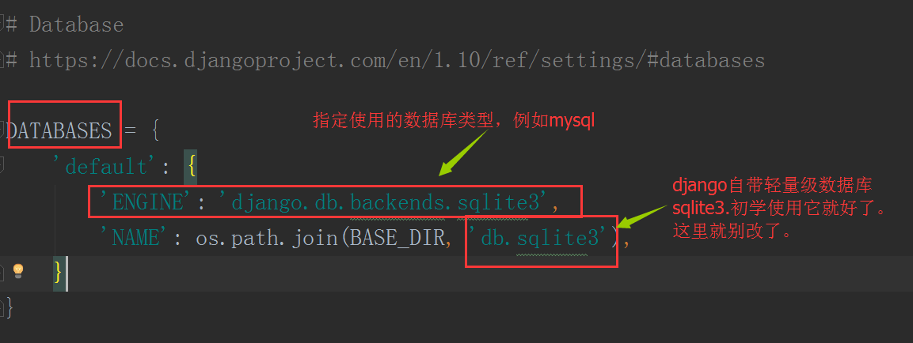
> settings.py, 配置数据库，这里不修改

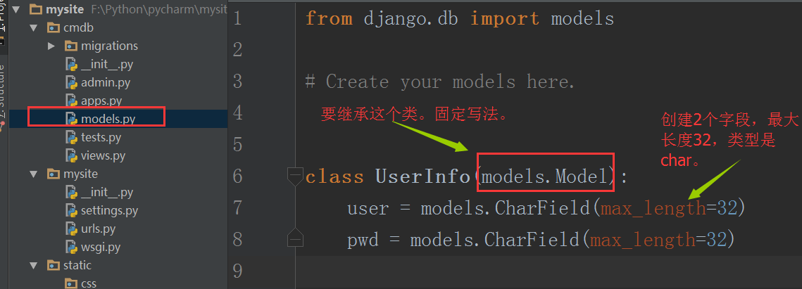
> models.py, MTV中的M

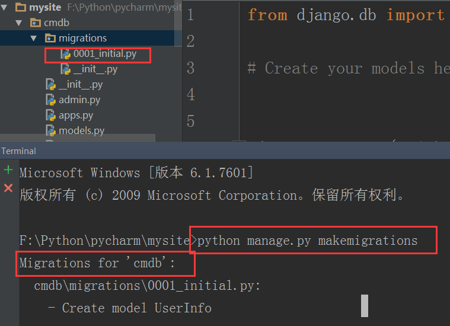
> 通过2条命令创建数据库的表

> python manage.py makemigrations

> python manage.py migrate

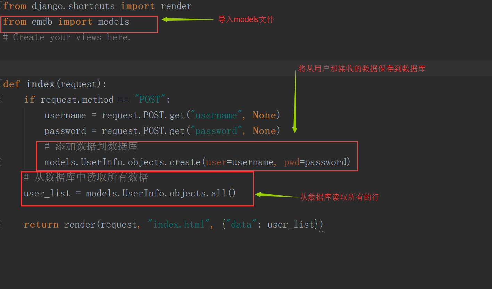
> views.py, 关联数据库

(完)
