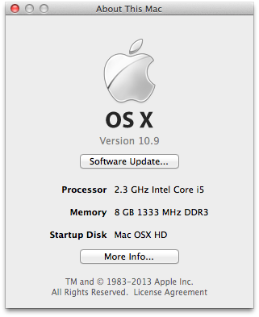
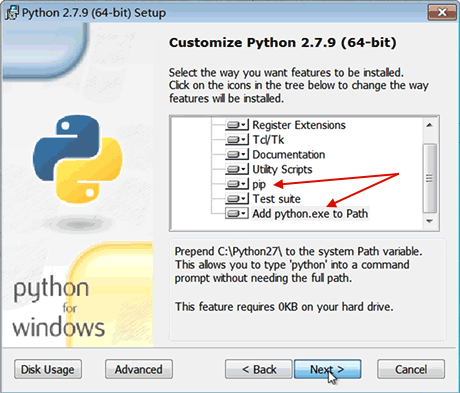
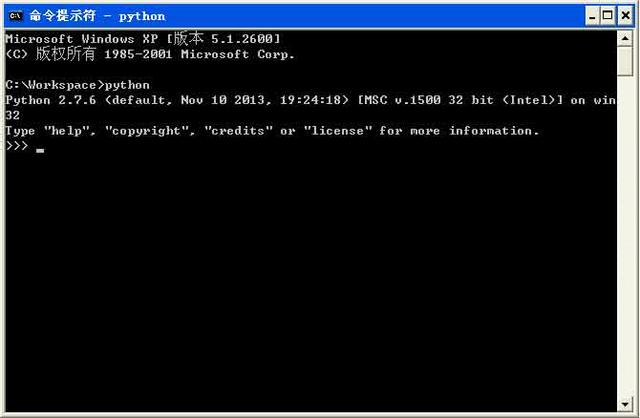

# 安装Python

阅读: 565029

因为Python是跨平台的，它可以运行在Windows、Mac和各种Linux/Unix系统上。在Windows上写Python程序，放到Linux上也是能够运行的。

要开始学习Python编程，首先就得把Python安装到你的电脑里。安装后，你会得到Python解释器（就是负责运行Python程序的），一个命令行交互环境，还有一个简单的集成开发环境。

## 2.x还是3.x

目前，Python有两个版本，一个是2.x版，一个是3.x版，这两个版本是不兼容的，因为现在Python正在朝着3.x版本进化，在进化过程中，大量的针对2.x版本的代码要修改后才能运行，所以，目前有许多第三方库还暂时无法在3.x上使用。

为了保证你的程序能用到大量的第三方库，我们的教程仍以2.x版本为基础，确切地说，是2.7版本。请确保你的电脑上安装的Python版本是2.7.x，这样，你才能无痛学习这个教程。

## 在Mac上安装Python

如果你正在使用Mac，系统是OS X 10.8或者最新的10.9 Mavericks，恭喜你，系统自带了Python 2.7。如果你的系统版本低于10.8，请自行备份系统并免费升级到最新的10.9，就可以获得Python 2.7。

查看系统版本的办法是点击左上角的苹果图标，选择“关于本机”：

## 在Linux上安装Python

如果你正在使用Linux，那我可以假定你有Linux系统管理经验，自行安装Python 2.7应该没有问题，否则，请换回Windows系统。

对于大量的目前仍在使用Windows的同学，如果短期内没有打算换Mac，就可以继续阅读以下内容。

## 在Windows上安装Python

首先，从Python的官方网站python.org下载最新的2.7版本，网速慢的同学请移步国内镜像。

然后，运行下载的MSI安装包，在选择安装组件的一步时，勾上所有的组件：

特别要注意选上`pip`和`Add python.exe to Path`，然后一路点“Next”即可完成安装。

默认会安装到`C:\Python27`目录下，然后打开命令提示符窗口，敲入python后，会出现两种情况：

情况一：

看到上面的画面，就说明Python安装成功！

你看到提示符`>>>`就表示我们已经在Python交互式环境中了，可以输入任何Python代码，回车后会立刻得到执行结果。现在，输入`exit()`并回车，就可以退出Python交互式环境（直接关掉命令行窗口也可以！）。

情况二：得到一个错误：

‘python’不是内部或外部命令，也不是可运行的程序或批处理文件。
这是因为Windows会根据一个Path的环境变量设定的路径去查找python.exe，如果没找到，就会报错。如果在安装时漏掉了勾选`Add python.exe to Path`，那就要手动把python.exe所在的路径`C:\Python27`添加到Path中。

如果你不知道怎么修改环境变量，建议把Python安装程序重新运行一遍，记得勾上`Add python.exe to Path。`

小结

学会如何把Python安装到计算机中，并且熟练打开和退出Python交互式环境。
