参考文献：http://www.cnblogs.com/feixuelove1009/p/5823135.html

# Django快速参考

## 1.安装Django

sudo apt install python3-pip

pip3 install django

## 2.创建Project

## 3.创建App

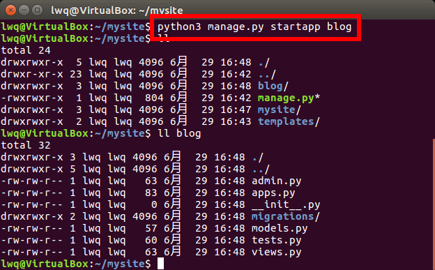

## 4.设置入口

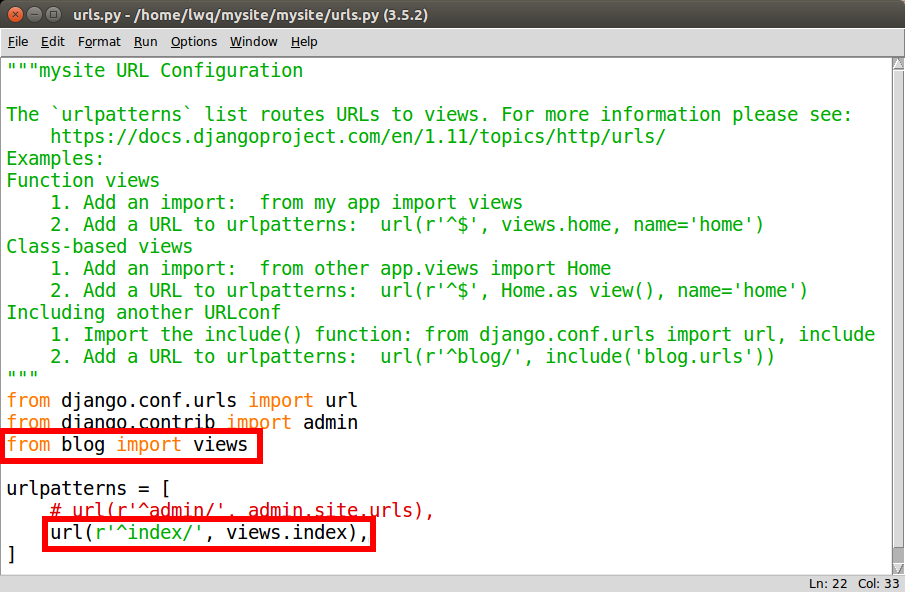

## 5.响应字符串

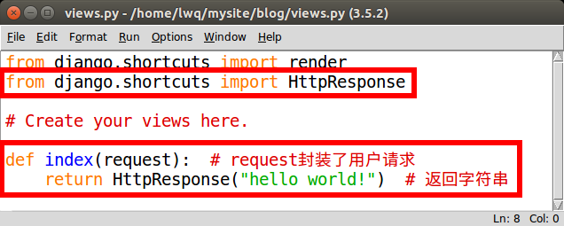

## 6.启动web服务

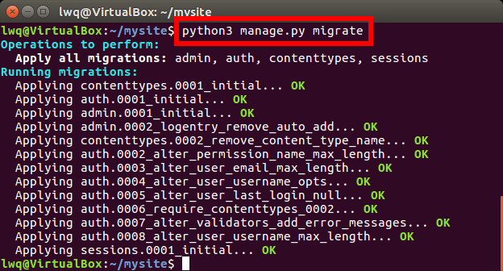

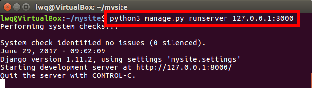

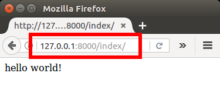

终端停止服务：Ctrl+Shift+C

## 7.响应html

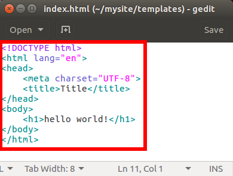

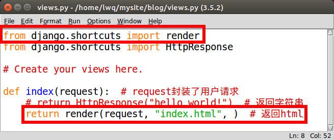

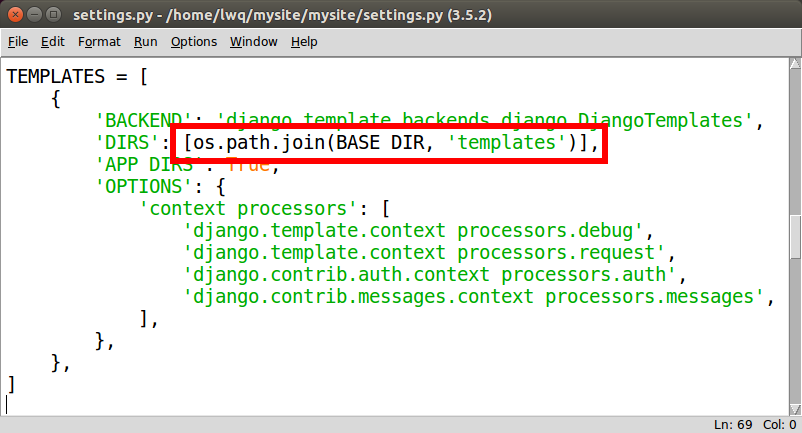

python3 manage.py runserver 127.0.0.1:8000

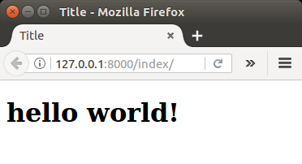

终端停止服务：Ctrl+Shift+C

## 8.static目录

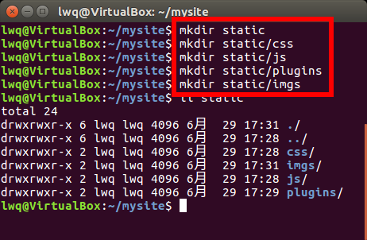
> 用于存放CSS,JS,插件等

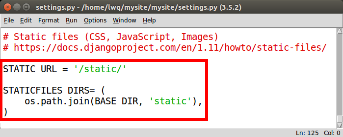

## 9.接收html表单

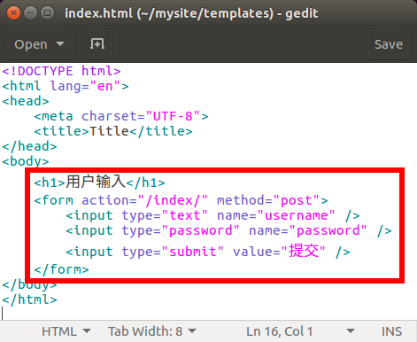

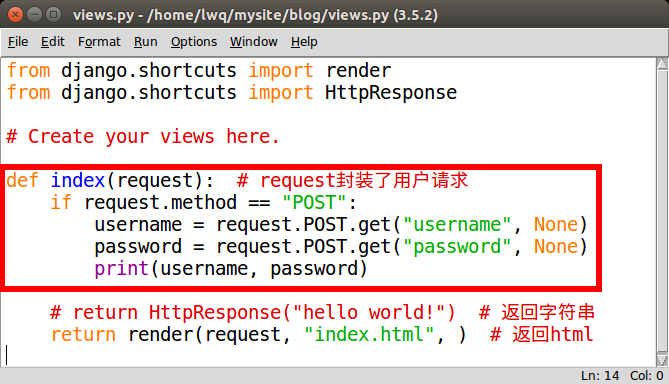

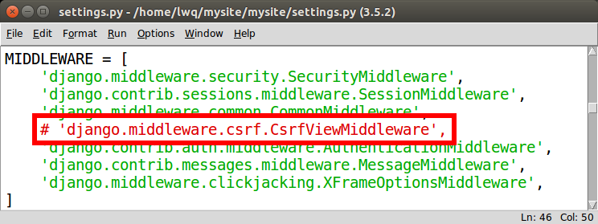

python3 manage.py runserver 127.0.0.1:8000

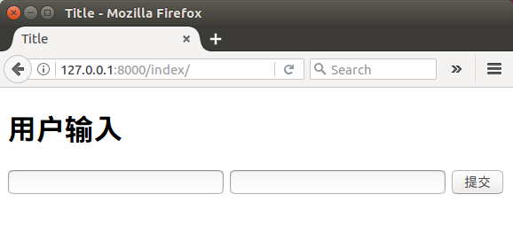

终端停止服务：Ctrl+Shift+C

## 10.数据交互

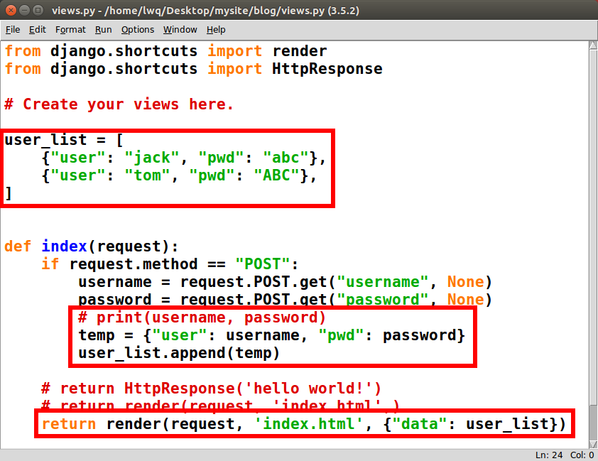

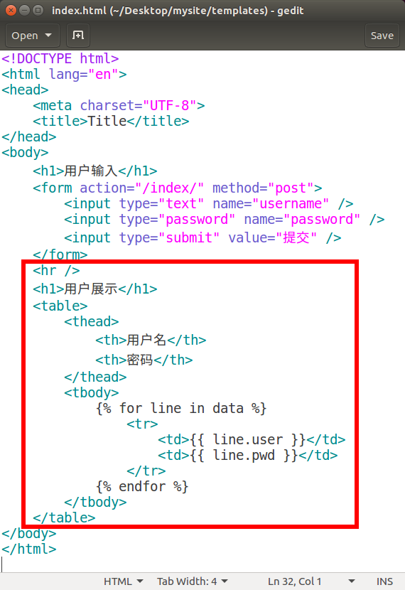

python3 manage.py runserver 127.0.0.1:8000

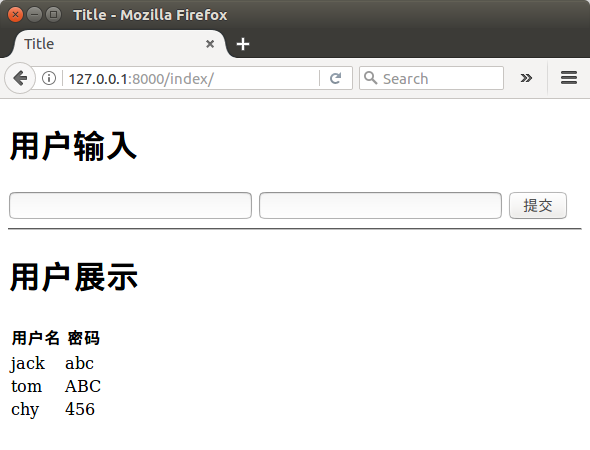

终端停止服务：Ctrl+Shift+C

## 11.数据库

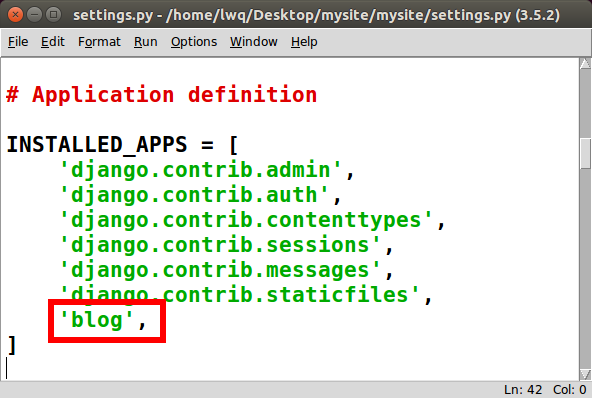

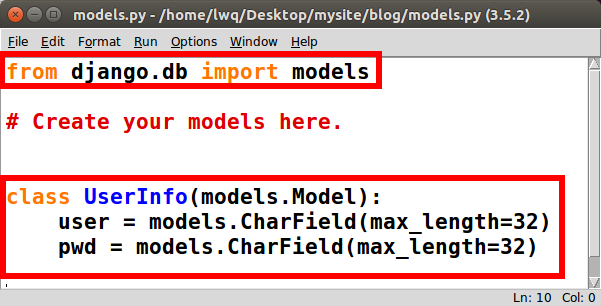

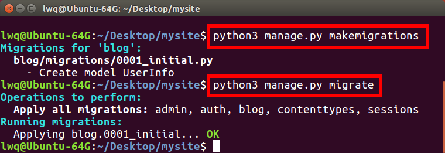

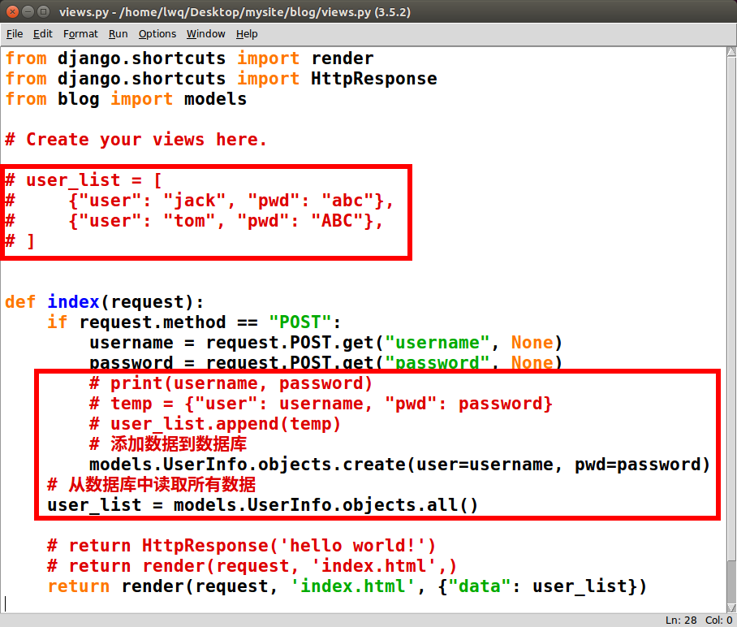

python3 manage.py runserver 127.0.0.1:8000

终端停止服务：Ctrl+Shift+C

(End)