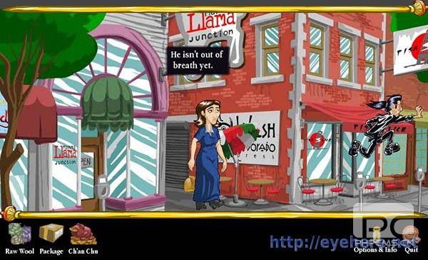

用Pygame和Python做游戏-从入门到精通（2）
时间：2016-03-24 08:56 来源：未知 作者：admin 阅读：531次
上次我们试着写了一个最简单的Pygame程序并且解释了一个大概的框架，这次就Pygame中也是游戏中最关键（……好吧，也许并不是最关键，但绝对是至关重要的一项）的事件来展开。

此图为一个用Pygame开发的游戏，或许有些简陋，但是只要你有爱，什么都能出来！
理解事件
事 件是什么，其实从名称来看我们就能想到些什么，而且你所想到的基本就是事件的真正意思了。我们上一个程序，会一直运行下去，直到你关闭窗口而产生了一个 QUIT事件，Pygame会接受用户的各种操作（比如按键盘，移动鼠标等）产生事件。事件随时可能发生，而且量也可能会很大，Pygame的做法是把一 系列的事件存放一个队列里，逐个的处理。
 
事件检索
上个程序中，使用了pygame.event.get()来处理所有的事件，这好像打开大门让所有的人进入。如果我们使用pygame.event.wait()，Pygame就会等到发生一个事件才继续下去，就好像你在门的猫眼上盯着外面一样，来一个放一个……一般游戏中不太实用，因为游戏往往是需要动态运作的；而另外一个方法pygame.event.poll()就好一些，一旦调用，它会根据现在的情形返回一个真实的事件，或者一个“什么都没有”。下表是一个常用事件集：
事件	产生途径	参数
QUIT	用户按下关闭按钮	none
ATIVEEVENT	Pygame被激活或者隐藏	gain, state
KEYDOWN	键盘被按下	unicode, key, mod
KEYUP	键盘被放开	key, mod
MOUSEMOTION	鼠标移动	pos, rel, buttons
MOUSEBUTTONDOWN	鼠标按下	pos, button
MOUSEBUTTONUP	鼠标放开	pos, button
JOYAXISMOTION	游戏手柄(Joystick or pad)移动	joy, axis, value
JOYBALLMOTION	游戏球(Joy ball)?移动	joy, axis, value
JOYHATMOTION	游戏手柄(Joystick)?移动	joy, axis, value
JOYBUTTONDOWN	游戏手柄按下	joy, button
JOYBUTTONUP	游戏手柄放开	joy, button
VIDEORESIZE	Pygame窗口缩放	size, w, h
VIDEOEXPOSE	Pygame窗口部分公开(expose)?	none
USEREVENT	触发了一个用户事件	code
如果你想把这个表现在就背下来，当然我不会阻止你，但实在不是个好主意，在实际的使用中，自然而然的就会记住。我们先来写一个可以把所有方法输出的程序，它的结果是这样的。

我们这里使用了wait()，因为这个程序在有事件发生的时候动弹就可以了。还用了font模块来显示文字（后面会讲的），下面是源代码：

import pygame
from pygame.locals import *
from sys import exit
 
pygame.init()
SCREEN_SIZE = (640, 480)
screen = pygame.display.set_mode(SCREEN_SIZE, 0, 32)
 
font = pygame.font.SysFont("arial", 16);
font_height = font.get_linesize()
event_text = []
 
while True:
 
    event = pygame.event.wait()
    event_text.append(str(event))
    #获得时间的名称
    event_text = event_text[-SCREEN_SIZE[1]/font_height:]
    #这个切片操作保证了event_text里面只保留一个屏幕的文字
 
    if event.type == QUIT:
        exit()
 
    screen.fill((255, 255, 255))
 
    y = SCREEN_SIZE[1]-font_height
    #找一个合适的起笔位置，最下面开始但是要留一行的空
    for text in reversed(event_text):
        screen.blit( font.render(text, True, (0, 0, 0)), (0, y) )
        #以后会讲
        y-=font_height
        #把笔提一行
 
    pygame.display.update()
小贴士： 
书上说，如果你把填充色的(0, 0, 0)改为(0, 255, 0)，效果会想黑客帝国的字幕雨一样，我得说，实际试一下并不太像……不过以后你完全可以写一个以假乱真甚至更酷的！
这个程序在你移动鼠标的时候产生了海量的信息，让我们知道了Pygame是多么的繁忙……我们第一个程序那样是调用pygame.mouse.get_pos()来得到当前鼠标的位置，而现在利用事件可以直接获得！
处理鼠标事件
MOUSEMOTION事件会在鼠标动作的时候发生，它有三个参数：
buttons – 一个含有三个数字的元组，三个值分别代表左键、中键和右键，1就是按下了。
pos – 就是位置了……
rel – 代表了现在距离上次产生鼠标事件时的距离
和MOUSEMOTION类似的，我们还有MOUSEBUTTONDOWN和MOUSEBUTTONUP两个事件，看名字就明白是什么意思了。很多时候，你只需要知道鼠标点下就可以了，那就可以不用上面那个比较强大（也比较复杂）的事件了。它们的参数为：
button – 看清楚少了个s，这个值代表了哪个按键被操作
pos – 和上面一样
处理键盘事件
键盘和游戏手柄的事件比较类似，为KEYDOWN和KEYUP，下面有一个例子来演示使用方向键移动一些东西。

background_image_filename = 'sushiplate.jpg'
 
import pygame
from pygame.locals import *
from sys import exit
 
pygame.init()
screen = pygame.display.set_mode((640, 480), 0, 32)
background = pygame.image.load(background_image_filename).convert()
 
x, y = 0, 0
move_x, move_y = 0, 0
 
while True:
    for event in pygame.event.get():
        if event.type == QUIT:
           exit()
        if event.type == KEYDOWN:
            #键盘有按下？
            if event.key == K_LEFT:
                #按下的是左方向键的话，把x坐标减一
                move_x = -1
            elif event.key == K_RIGHT:
                #右方向键则加一
                move_x = 1
            elif event.key == K_UP:
                #类似了
                move_y = -1
            elif event.key == K_DOWN:
                move_y = 1
        elif event.type == KEYUP:
            #如果用户放开了键盘，图就不要动了
            move_x = 0
            move_y = 0
 
        #计算出新的坐标
        x+= move_x
        y+= move_y
 
        screen.fill((0,0,0))
        screen.blit(background, (x,y))
        #在新的位置上画图
        pygame.display.update()
当我们运行这个程序的时候，按下方向键就可以把背景图移动，但是等等！为什么我只能按一下动一下啊……太不好试了吧？！用脚掌考虑下就应该按着就一直动下去才是啊！？Pygame这么垃圾么……
哦，真是抱歉上面的代码有点小bug，但是真的很小，你都不需要更改代码本身，只要改一下缩进就可以了，你可以发现么？Python本身是缩进编排来表现层次，有些时候可能会出现一点小麻烦，要我们自己注意才可以。
KEYDOWN和KEYUP的参数描述如下：
key – 按下或者放开的键值，是一个数字，估计地球上很少有人可以记住，所以Pygame中你可以使用K_xxx来表示，比如字母a就是K_a，还有K_SPACE和K_RETURN等。
mod – 包含了组合键信息，如果mod & KMOD_CTRL是真的话，表示用户同时按下了Ctrl键。类似的还有KMOD_SHIFT，KMOD_ALT。
unicode – 代表了按下键的Unicode值，这个有点不好理解，真正说清楚又太麻烦，游戏中也不太常用，说明暂时省略，什么时候需要再讲吧。
事件过滤
并 不是所有的事件都需要处理的，就好像不是所有登门造访的人都是我们欢迎的一样。比如，俄罗斯方块就无视你的鼠标，而在游戏场景切换的时候，你按什么都是徒 劳的。我们应该有一个方法来过滤掉一些我们不感兴趣的事件（当然我们可以不处理这些没兴趣的事件，但最好的方法还是让它们根本不进入我们的事件队列，就好 像在门上贴着“XXX免进”一样），我们使用pygame.event.set_blocked(事件名)来完成。如果有好多事件需要过滤，可以传递一个列表，比如pygame.event.set_blocked([KEYDOWN, KEYUP])，如果你设置参数None，那么所有的事件有被打开了。与之相对的，我们使用pygame.event.set_allowed()来设定允许的事件。
产生事件
通常玩家做什么，Pygame就产生对应的事件就可以了，不过有的时候我们需要模拟出一些事件来，比如录像回放的时候，我们就要把用户的操作再现一遍。
为了产生事件，必须先造一个出来，然后再传递它：

my_event = pygame.event.Event(KEYDOWN, key=K_SPACE, mod=0, unicode=u' ')
#你也可以像下面这样写，看起来比较清晰（但字变多了……）
my_event = pygame.event.Event(KEYDOWN, {"key":K_SPACE, "mod":0, "unicode":u' '})
pygame.event.post(my_event)
你甚至可以产生一个完全自定义的全新事件，有些高级的话题，暂时不详细说，仅用代码演示一下：

CATONKEYBOARD = USEREVENT+1
my_event = pygame.event.Event(CATONKEYBOARD, message="Bad cat!")
pgame.event.post(my_event)
 
#然后获得它
for event in pygame.event.get():
    if event.type == CATONKEYBOARD:
        print event.message
这次的内容很多，又很重要，一遍看下来云里雾里或者看的时候明白看完了全忘了什么的估计很多，慢慢学习吧~~多看看动手写写，其实都很简单。
下次讲解显示的部分
