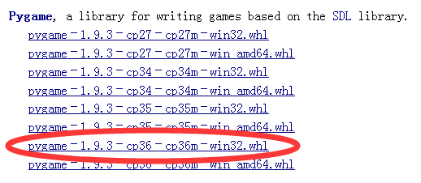
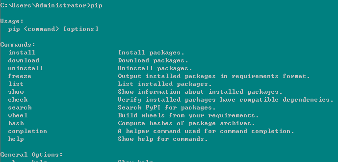
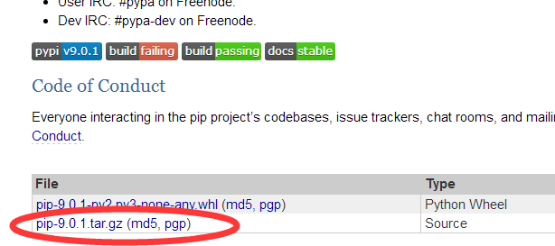
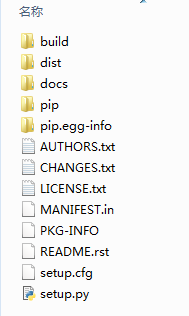
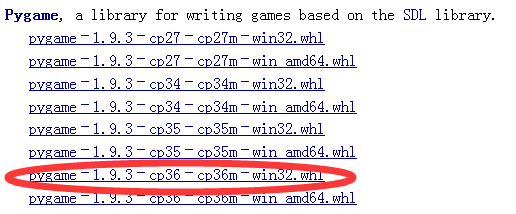
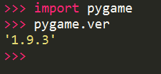

# 我的安装：

1.sudo apt install python3-pip

2.pip3 install pygame-1.9.3-cp35-cp35m-manylinux1_x86_64.whl

3.ok

-------------------------------------------------------
http://www.cnblogs.com/Jacklovely/p/6524572.html

# python学习笔记（15）--pygame的安装

说明：

1. 现在是2017.3.9号，最新的python版本是3.6，最新的pygame是1.9.3，这两个最好都用32位的。

2. pygame1.9.3下载地址：http://www.lfd.uci.edu/~gohlke/pythonlibs/#pygame

    选这个python3.6版本的，32位。

3. python要先安装pip，这个pip相当于苹果手机的appstore，专门用来安装python的扩展库。有人说python3.6已经集成pip了，我是没看见有。

    判断方法是cmd输入pip，会出来一坨东西：

没有的话就要先安装了，官网是：https://pypi.python.org/pypi/pip#downloads ：，或者直接点这个下载：pip-9.0.1.tar.gz

（1）官网的话，下载红圈里这个玩意，解压：

（2）解压完是这个样子的：

（3）在cmd里cd到这个解压目录，输入python setup.py install，这就安装完pip了，试试在cmd里输入pip，就能出来上面那一坨信息了。

4. 现在开始安装pygame。

（1）首先要下载pygame，官网是：http://www.pygame.org/download.shtml，但在这里你找不到最新的支持python3.6的pygame，推荐使用另一个下载地址：http://www.lfd.uci.edu/~gohlke/pythonlibs/#pygame，下载红圈里的pygame1.9.3版本的32位。

这是一个whl后缀名的文件，应该是wheel轮子的缩写（意思是轮子都给你准备好了，不要重复造轮子么？），这种wheel文件就需要pip来进行安装，所以之前我们必须要安装pip（上面的pip网址也提供pip的whl文件下载，但是没有安装pip怎么安装whl文件，搞不懂，难道可以通过别的方式安装whl？）。

总而言之，我们下载好了pygame的whl文件，同样的在cmd里cd到这个whl所在目录，输入pip install pygame-1.9.3-cp36-cp36m-win32.whl

后面这个pygame-1.9.3-cp36-cp36m-win32.whl就是下载的pygame的whl文件的文件名全称，记得要加上whl扩展名。

做完这一步后，pygame就已经安装完成了，在python的IDLE里输入import pygame，如果不报错，就是安装成功了，再输入pygame.ver就能看到版本号：

注意：

1. python版本和pygame系统版本最好都用32位，如果都是64位的话我没试过，但是一个32位一个64位肯定是不行的。

2. python版本和pygame软件版本要配套，比如你的python事3.6，要看清楚pygame支持的python版本是不是3.6。

3. 如果cmd输入python都报错的话，可能是没有添加环境变量，方法可以看看下面的参考资料。

本文主要参考了下面两篇博客，感谢！：

http://www.cnblogs.com/yuanzm/p/4089856.html?utm_source=tuicool&utm_medium=referral

http://blog.csdn.net/zjiang1994/article/details/52689144

