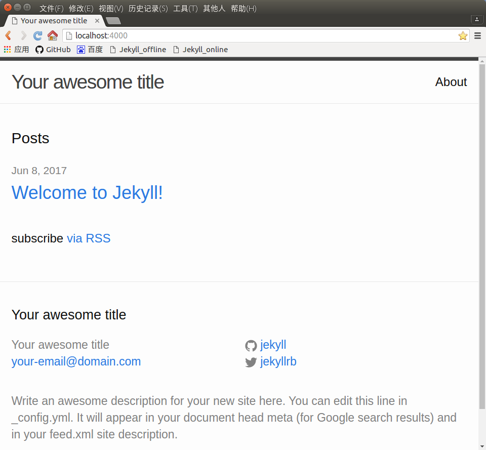
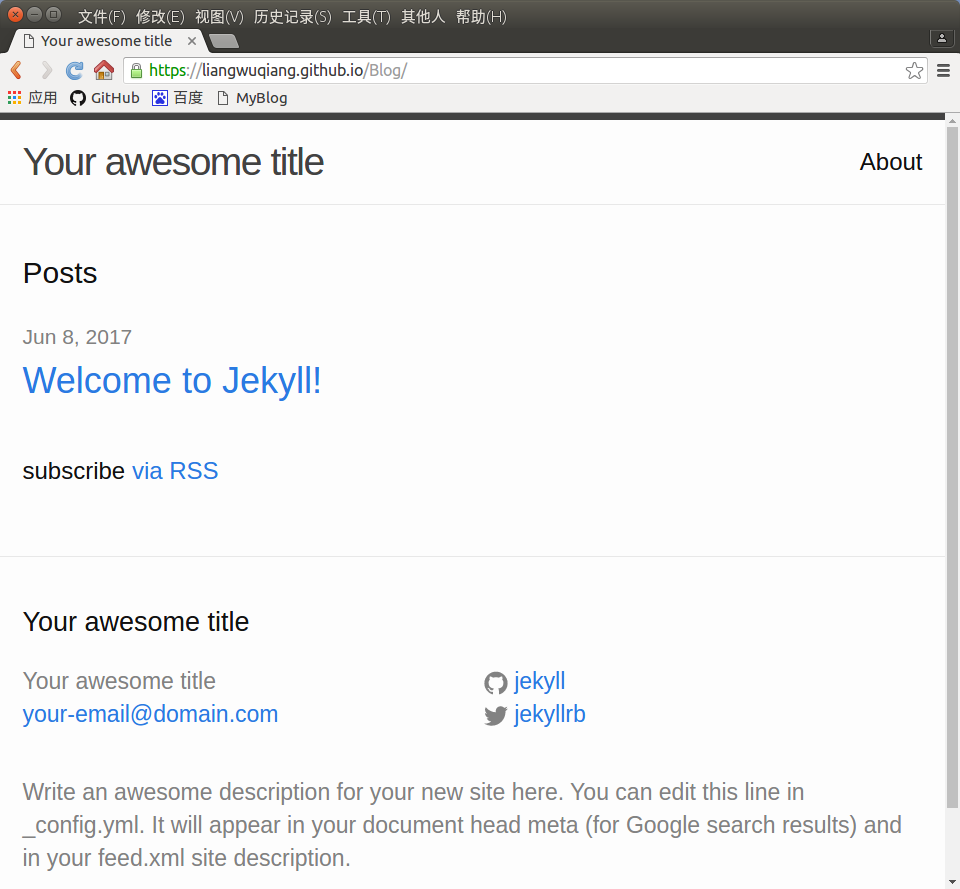

# Jekyll搭建Blog环境

## //搭建jeckyll环境

1. $ sudo apt install ruby

2. $ sudo gem install jekyll

3. sudo apt install jeckyll

4. jeckyll new myblog

5. cd myblog

## //建立仓库并推送到网上

6. git init  //创建git仓库

7. git add . //往仓库中添加所用文件

8. git commit -m "first commit"  //提交到本地仓库

9. 在Github上创建一个空的仓库Blog

10. 复制链接 git@github.com:liangwuqiang/Blog.git

11. git remote add origin git@github.com:liangwuqiang/Blog.git  //将链接指定为origin

12. git push -u origin master  //本地仓库的master分支推送到网上和origin对应的链接上，并关联好，以便以后直接使用

## //本地调试

13. jekyll server

14. 在浏览器中输入网址：http://localhost:4000

## //网上效果

15. 进入仓库 https://github.com/liangwuqiang/Blog

16. 点Settings=>GitHub Pages=>Source=>Select source=>master branch=>Save

17. 此时上一行出现了链接 https://liangwuqiang.github.io/Blog/

18. 进入链接

