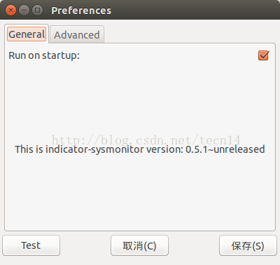
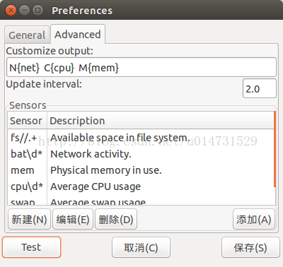

原文地址：http://blog.csdn.net/zn2857/article/details/52599980

原文地址：http://blog.csdn.NET/tecn14/article/details/24489031

## 64位Ubuntu kylin 16.04显示CPU内存使用率 

有时感觉网络失去响应，就通过Ubuntu 14.04自带的系统监视器程序来查看当前网速，
但是这样很不方便，遂打算让网速显示在标题栏，那样就随时可直观的看到。
一番搜索尝试后，成功实现！同时也实现了CPU、内存使用率等的显示。

先来看下效果图：

效果真是挺好的！

之前需要通过deb包安装，现在可以通过添加PPA安装：

   sudo add-apt-repository ppa:fossfreedom/indicator-sysmonitor

   sudo apt-get update

   sudo apt-get install indicator-sysmonitor

终端执行：  indicator-sysmonitor &，然后Ctrl+C就可以实现后台运行indicator-sysmonitor，
看下图标效果，效果很不错！

为了方便还要为程序添加开机启动！鼠标右键点击标题栏上图标，弹出菜单，选择首选项，出现如下界面：

勾上Run on startup:， 这样就能开机启动了。切换到 Advanced 选项，

可以对要显示的信息的格式进行设置。

可以尝试设置其他格式，再Test，直到效果满意再点击保存。

好了，到此就结束了！
